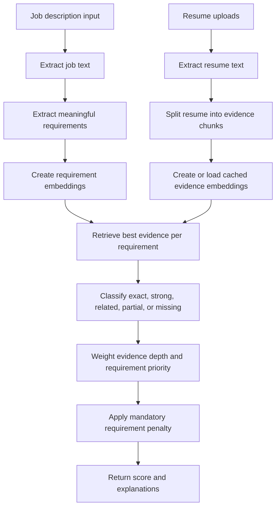

# Matchline

Matchline is a general-purpose Resume-Job Matching application. It compares a job description with one or more resumes using semantic similarity, contextual evidence, practical experience, and configurable requirement weighting.

It is designed for software, data, cloud, finance, HR, marketing, sales, engineering, operations, and other professional roles. The matching engine is not built around one profession.

> Matchline is decision-support software. It does not make hiring decisions and should not be used as the only basis for one.

## What the system does

The application accepts:

- A pasted or uploaded job description
- One or more PDF, DOCX, or TXT resumes
- A scoring mode: semantic embeddings or lightweight TF-IDF

It returns:

- An overall match score from 0 to 100
- Existing matched and missing skill lists
- Job requirements extracted from the description
- The best resume evidence for every requirement
- Match classifications and explanations
- Evidence depth, such as mentioned, practical, or demonstrated
- Mandatory requirements that are missing or only partially supported

## End-to-end workflow



### 1. Input and file handling

The React frontend sends the job description and resume files as multipart form data to FastAPI. The backend validates extensions and reads each file in memory for the request.

Supported formats:

- **PDF:** extracted with `pdfplumber`
- **DOCX:** extracted with `python-docx`, including table cells
- **TXT:** decoded as UTF-8 with error tolerance

This keeps file handling in one backend boundary and allows the same parser to be used for job descriptions and resumes.

### 2. Job requirement extraction

`utils/evidence.py` splits the job description into meaningful sentences or bullet items, removes duplicates, and limits the number of requirements to keep inference responsive.

Each requirement is classified dynamically into categories such as:

- Technical Skills
- Responsibilities
- Experience
- Education
- Certifications
- Soft Skills
- Domain Knowledge

The classifier uses general language cues such as degree terms, years of experience, responsibility verbs, certification terms, and taxonomy matches. It does not assume that a job is an AI/ML job.

The extractor also detects priority language:

- **Mandatory:** `required`, `must`, `minimum`, `essential`, `mandatory`
- **Preferred:** `preferred`, `nice to have`, `bonus`, `desirable`

### 3. Resume evidence chunking

The system does not create one embedding for the entire resume. It splits the resume into smaller evidence units and tracks the likely section for each unit:

- Professional experience
- Projects
- Internships
- Education
- Certifications
- Skills
- Summary
- Other sections

Smaller chunks make retrieval more precise. For example, a requirement about production deployment can retrieve a work-experience bullet rather than matching against unrelated education text.

### 4. Semantic retrieval

The semantic mode uses the pretrained `sentence-transformers/all-MiniLM-L6-v2` model. It converts each job requirement and resume evidence chunk into a normalized vector and compares them with cosine similarity.

This allows meaning-based relationships such as:

- `modern frontend framework` and `React`
- `relational databases` and `PostgreSQL`
- `document retrieval` and `semantic search with embeddings`
- `production software development` and `built, tested, and deployed applications`

The model is loaded once with an in-process cache. Resume chunk embeddings are also cached so repeated scoring of the same resume does not encode the same text again.

### 5. Exact and semantic match classification

For each requirement, the system selects the most relevant resume evidence and assigns one classification:

| Classification | Meaning |
| --- | --- |
| **Exact match** | The requested taxonomy skill or technology is explicitly present in the evidence. |
| **Strong semantic match** | The evidence is very close in meaning and describes relevant work. |
| **Related but not confirmed** | The evidence is conceptually related, but direct experience is not proven. |
| **Partial match** | Some meaning overlaps, but the evidence does not satisfy the complete requirement. |
| **Not found** | No sufficiently relevant evidence was retrieved. |

An explicit technology is never silently substituted for another technology. For example, Docker can be related to Kubernetes, but Docker alone does not become an exact Kubernetes match.

### 6. Evidence depth

The same skill receives different credit depending on how it appears in the resume:

- **Mentioned:** appears in a skills list, summary, or weak context
- **Practical:** appears in a project, internship, certification, or action-oriented statement
- **Demonstrated:** appears in professional experience with implementation or delivery language

Action verbs such as `built`, `implemented`, `tested`, `deployed`, `managed`, and `designed` increase evidence strength. Work experience and projects receive more weight than a bare skills-list mention.

### 7. Score calculation

The final score is based on every extracted requirement rather than a simple keyword count.

Each match classification has a base value:

| Match | Base value |
| --- | ---: |
| Exact match | 1.00 |
| Strong semantic match | 0.88 |
| Related but not confirmed | 0.62 |
| Partial match | 0.40 |
| Not found | 0.00 |

The base value is multiplied by an evidence-depth factor and a requirement-priority weight:

- Demonstrated evidence: `1.00`
- Practical evidence: `0.90`
- Mentioned evidence: `0.72`
- Mandatory requirement weight: `1.25`
- Preferred requirement weight: `0.85`
- Normal requirement weight: `1.00`

The weighted requirement values are averaged into the overall score. If mandatory requirements are missing or only partial, the score receives an additional capped penalty. A missing requirement affects the result without automatically rejecting the candidate.

### 8. Lightweight TF-IDF mode

TF-IDF mode is available when model download or embedding inference is undesirable. It uses a vectorizer trained on the resume corpus in `data/Resume/Resume.csv`.

This mode is useful for:

- Offline or restricted environments
- Fast keyword and phrase retrieval
- Development and smoke testing
- A fallback when the embedding model is unavailable

It is less capable than semantic mode for synonyms and conceptual relationships. The main semantic mode remains the recommended option.

## Dataset training

The repository contains a labeled resume corpus at `data/Resume/Resume.csv`. The labels are job categories, while the resume text is used to learn a domain vocabulary and useful unigrams/bigrams.

The training script:

1. Reads the `Resume_str` column
2. Removes empty records
3. Learns a corpus-aware TF-IDF vocabulary
4. Uses unigrams and bigrams to capture short phrases
5. Applies English stop-word filtering and sublinear term frequency
6. Saves the vectorizer to `models/resume_tfidf.joblib`

Run training with:

```powershell
python scripts\train_resume_model.py
```

The generated artifact is ignored by Git and should be regenerated whenever the resume dataset changes. Docker also runs this training step during image creation.

Important distinction: this dataset does not contain paired job descriptions and relevance labels, so it trains the lightweight lexical vocabulary but does not fine-tune the embedding model or prove ranking accuracy. A reliable accuracy benchmark requires labeled job-description/resume pairs.

## Technology choices

| Technology | Why it is used |
| --- | --- |
| **React** | Provides a responsive upload and result interface without coupling UI state to the Python runtime. |
| **Vite** | Provides fast frontend development and a small production build. |
| **FastAPI** | Exposes typed, asynchronous upload and scoring endpoints with automatic API validation. |
| **Uvicorn** | Runs the FastAPI application in development and production. |
| **Sentence-Transformers** | Converts requirements and resume evidence into semantic vectors for meaning-based matching. |
| **all-MiniLM-L6-v2** | A relatively small general-purpose embedding model with practical local inference cost. |
| **scikit-learn** | Supplies TF-IDF vectorization and cosine similarity operations. |
| **pdfplumber** | Extracts text from PDF resumes and job descriptions. |
| **python-docx** | Extracts paragraphs and table content from DOCX files. |
| **joblib** | Serializes and loads the trained TF-IDF artifact efficiently. |
| **NumPy** | Performs fast normalized vector and matrix operations. |
| **Lucide React** | Supplies consistent interface icons without custom SVG maintenance. |

## Project structure

```text
resume-job-match-scorer/
├── api/
│   ├── __init__.py
│   └── main.py                    # FastAPI routes, validation, and static serving
├── data/
│   ├── Resume/Resume.csv          # Resume training corpus
│   └── skills_taxonomy.json       # Curated taxonomy for exact skill corroboration
├── frontend/
│   ├── src/main.jsx               # React workflow and result rendering
│   ├── src/styles.css              # Existing visual design and evidence styles
│   ├── package.json
│   └── index.html
├── scripts/
│   └── train_resume_model.py      # Builds the corpus-aware TF-IDF artifact
├── utils/
│   ├── parser.py                  # PDF, DOCX, and TXT extraction
│   ├── scorer.py                  # Cached embeddings and batch similarity helpers
│   ├── evidence.py                # Requirement extraction and evidence scoring
│   └── skills.py                   # Taxonomy extraction and legacy skill lists
├── requirements.txt
├── Dockerfile
└── README.md
```

## Local development

### Prerequisites

- Python 3.10 or newer
- Node.js and npm
- Internet access once to obtain the embedding model, unless it is already cached

### Start the backend

```powershell
venv\Scripts\Activate.ps1
pip install -r requirements.txt
python scripts\train_resume_model.py
uvicorn api.main:app --reload
```

The API runs at `http://localhost:8000`.

### Start the frontend

In a second terminal:

```powershell
cd frontend
npm install
npm run dev
```

The frontend runs at `http://localhost:5173` and sends development requests to the FastAPI server.

### Run the production frontend build

```powershell
cd frontend
npm run build
```

When `frontend/dist` exists, FastAPI serves the built frontend from the same application in production.

## API reference

### `GET /api/health`

Returns:

```json
{"status": "ok"}
```

### `POST /api/score`

Accepts multipart form data:

- `jd_text`: pasted job description; optional when `jd_file` is supplied
- `jd_file`: one PDF, DOCX, or TXT job description file
- `resumes`: one or more PDF, DOCX, or TXT resume files
- `method`: `semantic` or `tfidf`

The response preserves the original `filename`, `score`, `matched`, and `missing` fields and adds `analysis`:

```json
{
  "filename": "candidate.txt",
  "score": 78.4,
  "matched": ["Python", "React"],
  "missing": ["Kubernetes"],
  "analysis": {
    "overall_score": 78.4,
    "strong_matches": [],
    "partial_matches": [],
    "related_matches": [],
    "missing": [],
    "mandatory_missing": [],
    "requirements": []
  }
}
```

Each item in `analysis.requirements` contains the requirement text, category, mandatory/preferred flags, classification, similarity, evidence strength, evidence text, and explanation.

## Docker deployment

The Docker image installs Python dependencies, installs the frontend dependencies, trains the TF-IDF artifact, builds React, and serves the finished application through FastAPI:

```bash
docker build -t matchline .
docker run --rm -p 8000:8000 matchline
```

Open `http://localhost:8000`.

The container health check uses `GET /api/health`.

## Testing and limitations

The matching engine has been checked against:

- Exact taxonomy skill matches
- Semantic framework relationships
- Relational database relationships
- Conceptual retrieval/search relationships
- Responsibility and project evidence
- Missing mandatory technologies
- API response compatibility
- React production builds

The most important remaining evaluation step is a labeled benchmark containing job descriptions, resumes, and human relevance judgments. That benchmark can be used to tune thresholds and weights with precision, recall, and ranking metrics instead of relying only on semantic spot checks.
